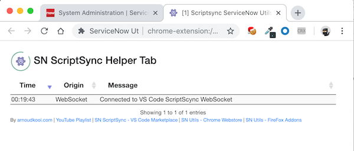

# ServiceNow VSCode ScriptSync
Easy Integration from ServiceNow to VSCode to be able to script in a full fledged editor, without any configuration.

## [YouTube video demonstrating usage](https://www.youtube.com/watch?v=vCQ-PtQYnGU)

# Servicenow Utils
Requires 
[ServiceNow Utils for Chrome](https://chrome.google.com/webstore/detail/servicenow-utils/jgaodbdddndbaijmcljdbglhpdhnjobg) or 
[ServiceNow Utils Firefox](https://addons.mozilla.org/nl/firefox/addon/servicenow-utils2/) 3.0 or higher.

# Setup
After installing both this extension and the browser extension, right click and enable in the browser context menu.

## Setting folder
In the settings page you can enter a default file path.
When this folder is opened as workspace, the service is automaticly started.
Default value for path: ~/Documents/sn-scriptsync

## Manual start stop
The ScriptSync service can be manually start stopped by clicking the Statusbar text in the bottom of the window.

## Enable in ServiceNow Utils
From the browser ScriptSync must be analed once, by using the 
context menu > VS Code ScriptSync > Enable

# Usage
While using be sure to keep the helper tab open. This will show logging and acts as a comunnication channel between ServiceNow and VS code. this can be opened from the context menu.

## Forms
After activating, in forms for appropriate fields, such as script, css and html a small save button will display.

Clicking it will save the current field value direct to the filesystem and open it in VS Code.

In VS Code the structure for the file will be:
instance/table/fiels^fieldname^scriptname^sys_id.extension

Saving it in VS Code, will save it back to the instance.

## Widgets
The workflow for ServicePortal widgets is shown in the animated gif above. From the widget editor click on the save button.
This will create all the relevant fields as file on the filesystem, in a folder with the name of the widget.
Besides that a file test_urls.txt is created.
In a subfolder the angular ng-templates will be placed.
In this page you can add your own urls. When saving a file, ScriptSync will refresh the browserpages that match that URL, enabeling live preview.

## ESLint
I recommend installing ESLint and the [ESLint ServiceNow plugin](https://www.npmjs.com/package/eslint-plugin-servicenow).
This will do some basic codechecks

## Issues
Please report an isue on GitHubn if you experience problems, or have a feature request.

